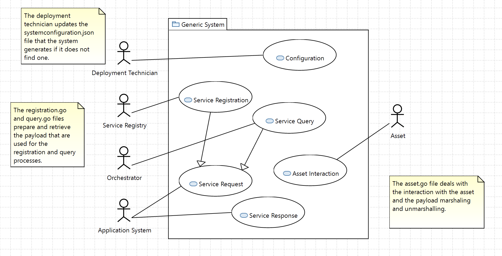
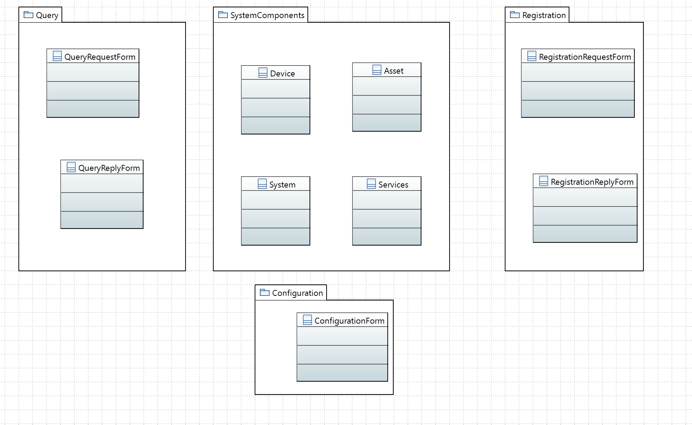

# solid-funicular
The name for this repository was suggested by GitHub.

The point of this repository is to experiment with GoA.

This is a Go implementation of the Eclipse Arrowhead framework that has a service oriented architecture (SOA).
The framework relies on a system of systems called a local cloud where systems offer and consume services from each other.
Provided services are reregistered for that local cloud in a core system called the Service Registry.
To obtain the location of a service, a consumer system need to query the Orchestrator system of the local cloud.

The Go implementation strives to have a common structural pattern for all systems.
A system is made up of a system shell (this application) and an asset (e.g., sensor, actuator, database, PLC, algorithm)

---
## The use cases
The [use case overview](Artwork/ModelingLocalClouds 2.pdf) is the climate control local cloud consisting of the six systems.

The use cases for each system is

## Class Diagrams and Packages (files in our case)
The Structs modeling the components of each system are at the heart of a collection of forms used to form (and unmarshal) payloads that are exchanged between systems.

## Activity Diagrams
The Main.go file is straight forward.
The idea is to initialize the base components and then let the client and server part of the system shell handle the communications until the process (application) is killed.

---
## Branches
Each branches of this repository represent a system (a variation) such as the Service Registry, Orchestrator, Thermometer, Thermostat, Valve systems.
Since the underlying structure is the same, not much needs to be changed.
Some of the files are the same allowing easy upgrades.

The master branch is a clock system that attempt to register its service every 10 seconds after start up. The system's time service is available at [http://localhost:3560/clock/time](http://localhost:3560/clock/time) when the system is running.

